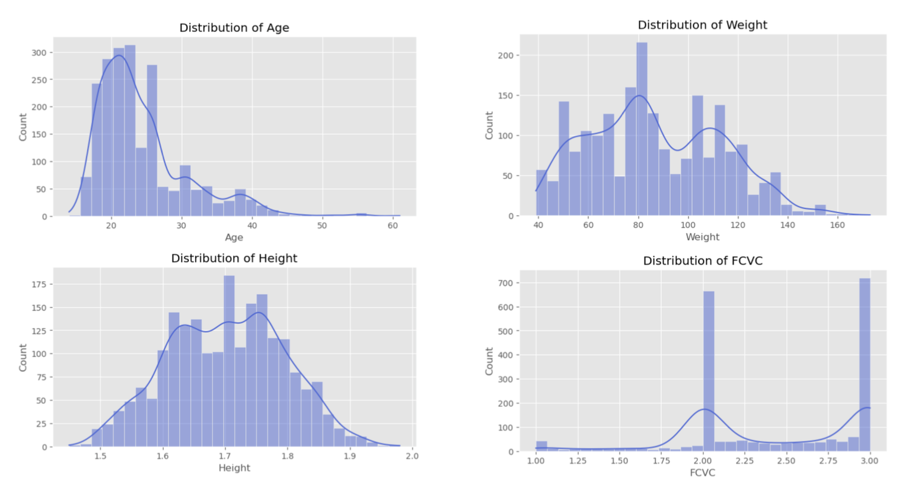

# MSDS422_Final Group 3 Project: Obesity Risk Prediction: A Machine Learning Approach

**Authors**: Jinghan Feng, Yahui Qian, Zixuan Zhang, Chenyi Zhao

**Dataset**: Access from [Kaggle - Obesity Prediction Dataset](https://www.kaggle.com/datasets/ruchikakumbhar/obesity-prediction/code)

## Table of Contents

- [Executive Summary](#executive-summary)
- [Problem Statement](#problem-statement)
- [Research Objectives](#research-objectives)
- [Features](#features)
- [Dataset](#dataset)
- [Getting Start](#getting-start)
- [Methodology](#methodology)
- [Results](#results)
- [Deployment Strategy](#deployment-strategy)
- [Limitations](#limitations)
- [Future Improvements](#future-improvements)
- [License](#license)
  
## Executive Summary  
Obesity is a growing public health concern in Latin America, significantly impacting individual health and straining healthcare systems. This research investigates the complex factors contributing to obesity in Mexico, Colombia, and Peru, employing a multidisciplinary approach that combines dataset analysis, statistical modeling, and machine learning techniques.  

The research highlights key findings such as the role of socioeconomic, dietary, and behavioral factors and explores advanced computational tools for estimating obesity levels and predicting associated risks. This study leverages a dataset containing 17 attributes and 2,111 records, categorizing individuals into seven distinct obesity levels. The dataset encompasses diverse features such as demographic data, physical measurements, and lifestyle behaviors, including caloric intake, physical activity frequency, and alcohol consumption.  

By analyzing this dataset, the project aims to explore the complex interplay of these factors, identify patterns and trends, and develop predictive models to estimate obesity levels. Advanced statistical techniques, such as handling class imbalances with SMOTE and applying machine learning algorithms like Random Forest and Gradient Boosting, will be utilized to enhance prediction accuracy.  

This research provides a foundation for data-driven public health interventions, offering actionable insights for mitigating obesity through targeted, culturally sensitive strategies tailored to the unique demographic characteristics of these regions.  

## Problem Statement  
Obesity has emerged as a growing epidemic in Latin America, driven by a convergence of unhealthy eating habits, sedentary lifestyles, and socioeconomic disparities. Despite its widespread impact on health systems and populations, current interventions often fail to address the multifaceted nature of obesity or utilize data effectively to inform public health strategies. There is a pressing need for robust predictive models and analytical frameworks that can uncover underlying trends, identify at-risk populations, and guide targeted, evidence-based interventions.  

## Research Objectives  
- To explore and analyze the relationships between demographic factors, dietary habits, physical activity levels, and obesity levels in individuals from Mexico, Peru, and Colombia.  
- To provide actionable insights that can guide policymakers and public health practitioners in designing effective, culturally appropriate interventions to combat obesity in Latin America.  
- To identify key predictors of obesity levels, such as high-calorie food consumption, physical activity frequency, and technology usage, and assess their relative importance.  
- To develop and evaluate predictive models using machine learning algorithms such as Random Forest, Gradient Boosting, and Neural Networks for accurately estimating obesity levels.  

## Features
This project includes:
- **Exploratory Data Analysis (EDA):** Feature distributions, correlations, and key insights.
- **Feature Engineering:** Handling missing data, encoding categorical variables, and scaling numerical features.
- **Machine Learning Models:** Comparison of multiple models:
  - Random Forest
  - Gradient Boosting
  - Support Vector Machines (SVM)
  - Neural Network (MLP)
  - Deep Neural Network (DNN)
- **Evaluation Metrics:** Accuracy, Precision-Recall, ROC-AUC.

## Dataset
- **Source:** The dataset includes **numerical and categorical** features related to diet, activity, and BMI.
- **Target Variable:** Obesity levels classified into seven categories.

## Getting Start
For getting started with this project, follow these steps:

1. **Clone the Repository**  
   Use Git to clone the repository to your local machine. You can do this using either **SSH** (recommended) or **HTTPS**, depending on your GitHub authentication setup.

2. **Navigate to the Project Directory**  
   After cloning, navigate into the project folder.

3. **Install Dependencies**  
   Ensure you have Python installed, then use `pip` to install the necessary dependencies from the `requirements.txt` file.

4. **Run the Jupyter Notebook**  
   Launch Jupyter Notebook and open the relevant `.ipynb` file to explore the analysis and run the models.

Make sure you have the appropriate GitHub access permissions if using SSH, or generate a GitHub personal access token (PAT) if using HTTPS authentication.

## Methodology
The study follows a structured machine learning pipeline, including data preprocessing, exploratory data analysis, feature engineering, model selection, training, evaluation, and hyperparameter tuning. Various classification models such as Random Forest, Gradient Boosting, Support Vector Machines (SVM), and Multi-Layer Perceptron (MLP) were implemented to predict obesity levels based on behavioral and demographic features. Data balancing techniques like SMOTE were used to handle class imbalances, and model performance was assessed using metrics such as accuracy, precision, recall, and F1-score.

## Results
| Model | Accuracy (%) |
|--------|------------|
| MLP | **97.64%** |
| SVM | 96.69% |
| Gradient Boosting | 96.22% |
| Random Forest | 94% |
| Deep Neural Network | 93.38% |

The study found that MLP outperformed all other models, achieving the highest accuracy (97.64%) for obesity classification. SVM and Gradient Boosting also performed well, with accuracies above 96%. Feature importance analysis indicated that key predictors of obesity include weight, height, family history, diet, and physical activity levels. The results highlight the effectiveness of machine learning in identifying obesity risk factors but also reveal limitations, such as dataset biases and missing socioeconomic variables.

## Deployment Strategy
The model is designed for local deployment to ensure data privacy and security. An automated machine learning pipeline is implemented for real-time or batch predictions. The system includes regular performance monitoring, retraining mechanisms, and an alert system to detect model drift. Future deployment considerations include integrating the model into public health platforms, mobile health applications, or government healthcare initiatives.

## Limitations
While the models performed well, several limitations exist. The dataset lacks socioeconomic and genetic variables, which are crucial for understanding obesity risk. The generalizability of the models is limited due to regional variations in obesity prevalence. Hyperparameter tuning was done using GridSearchCV, but alternative methods like Bayesian Optimization could improve performance. Additionally, deep learning models underperformed due to dataset constraints, suggesting that simpler models may be more suitable for structured health data.

## Future Improvements
To enhance model performance and applicability, future work should include expanding the dataset with socioeconomic and behavioral variables, exploring alternative feature selection techniques, and improving model interpretability. Further studies could investigate transfer learning approaches to apply the model across different populations. Additionally, integrating obesity prediction with real-time health monitoring systems and policy-driven interventions would increase its practical impact.

## License
This project is licensed under the [MIT License](LICENSE) - see the file for details.
